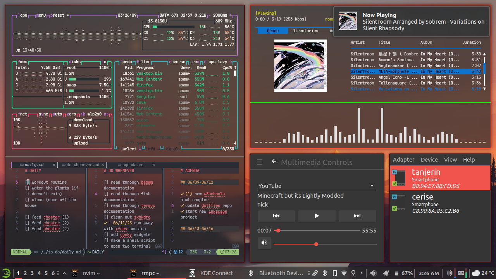

# spammy-xfbsp-dotfiles
| tiled layout | floating windows |
| -- | -- |
 | 

## a mix of xfce and bspwm
### setup instructions:
0. install the following: xfce bspwm picom alacritty tmux kvantum-manager symbols-only-nerd-fonts papirus-icon-theme papirus-folders
1. clone this repository and copy configurations into your .config:
```
git clone https://github.com/serspammy/spammy-xfbsp-dotfiles
cp -f ~/spammy-xfbsp-dotfiles/.config/* ~/.config/ 
```
2. open **Keyboard**, and go to **Application Shortcuts**
3. remove all shortcuts, as they will be handled by sxhkd instead
4. open **Session and Startup**
5. go to **Current Session**
6. for xfwm4 and xfce4-panel, set restart style to **never**
7. go to **Application Autostart**
8. add entries for bspwm, picom, xfsettingsd and xfce4-panel:
```
Name: BSPWM
Description: Binary Space Partitioning Window Manager
Command: bspwm
Trigger: on login

Name: Picom
Description: x11 compositing manager
Command: picom -b
Trigger: on login

Name: xfsettingsd
Description: Xfwm theme workaround
Comman: xfsettingsd --replace
Trigger: on login

Name: Xfce Panel
Description: Panel for the Xfce Desktop Environment
Command: xfce4-panel
Trigger: on login
```
9. install Vimix-dark-ruby theme
```
git clone https://github.com/vinceliuice/vimix-gtk-themes
cd vimix-gtk-themes
./install.sh -t ruby -c dark -l
```
10. enable flatpaks to use vimix-ruby-dark
```
flatpak override --filesystem=$HOME/.themes
flatpak override --env=GTK_THEME=Vimix-dark-ruby
```
11. use papirus-folders to change folder icon colors to red
```
wget -qO- https://git.io/papirus-folders-install | sh
papirus-folders -C red
```
12. go to appearance settings and select Vimix-dark-ruby and Papirus-Dark
13. open xfce-panel-profiles, click on 'import' and select `spammy.bspwm.tar.bz`
14. done, logout and back into xfce

sxhkd will automatically run alongside bspwm, no need to make an entry for that. optionally, you could actually just use xfce's keyboard settings for shortcuts, and forego sxhkd, but i find using sxhkd a little more convenient

the reason we have to disable xfce4-panel in 'Current Session', only to make a startup entry for it, is because leaving it like that would have the panel be invisible while still running. this is a workaround to that weird behavior

--- 
### basic stuff to install
- tmux (terminal multiplexer)
- bspwm (duh)
- xfce4 (desktop environment)
- picom (EYE CANDY 🤑🤑🤑🤑)
- alacritty (terminal)
- kvantum (qt theme manager)
- symbols-only-nerd-fonts (nerd font icons)

#### other things in screenshots:
- fastfetch
  - hyfetch for the gays
- fish
- qimgv
- cava
- cmatrix
- rmpc
- btop
- kitty (other terminal emulator)
---
### nerd fonts used:
- Ubuntu Mono (proportional/normal font)
- JetbrainsMono (monospace/terminal font)

  https://www.nerdfonts.com/font-downloads

### gtk/qt theme:
- [Vimix GTK](https://github.com/vinceliuice/vimix-gtk-themes)
- [Vimix KDE](https://github.com/vinceliuice/vimix-kde)

### icon theme
- [Papirus](https://github.com/PapirusDevelopmentTeam/papirus-icon-theme)

-----
### spammy's notes:

1. i suggest using `xfce4-session-settings` to handle startup programs
2. if you ever need to, you can replace bspwm with xfwm4 by opening a terminal and running `xfwm4 --replace` (unless you've uninstalled xfwm4)
3. alacritty windows will open attached to an existing tmux session by default, press `super + shift + Return (Enter)` to open in a normal fish session

---
### license
this repository is licensed under the **Do What The Fuck You Want To Public License**. it's just config files i literally don't care
