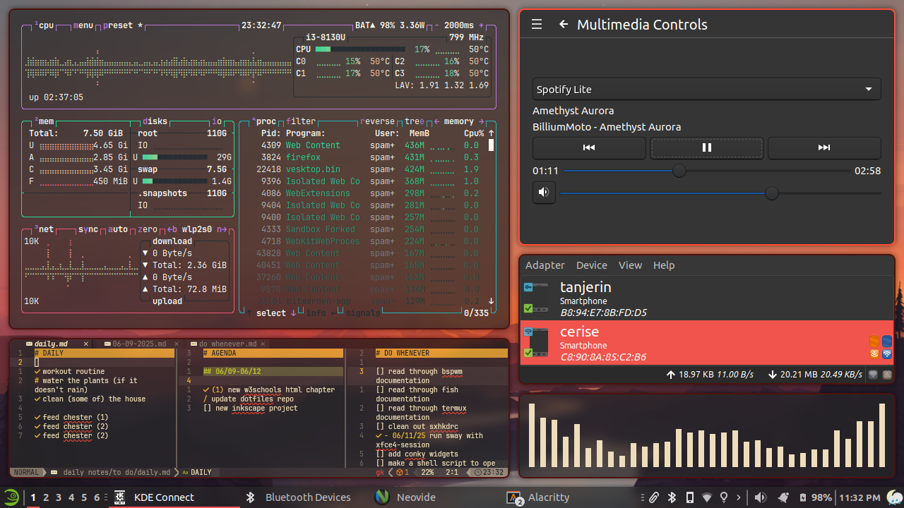
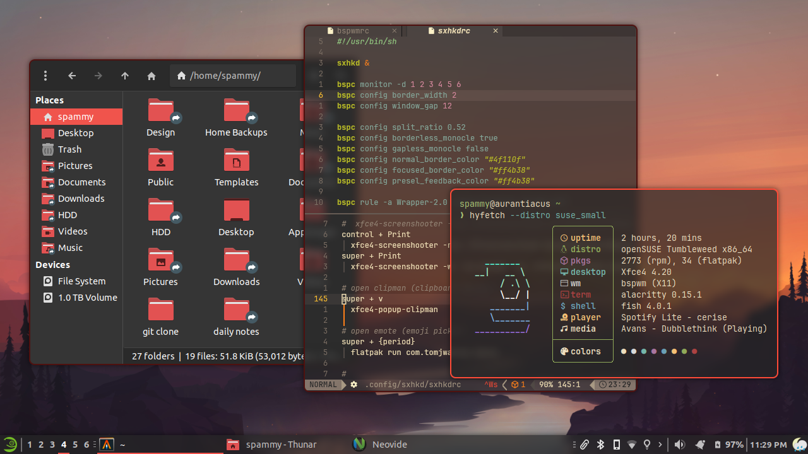

# spammy-xfbsp-dotfiles
| tiled layout | floating windows |
| -- | -- |
 | 

## a mix of xfce and bspwm
### setup instructions: TO DO

--- 
### basic stuff to install
- bspwm (duh)
- xfce4 (desktop environment)
- picom (EYE CANDY 🤑🤑🤑🤑)

#### other things in screenshots:
- fastfetch
  - hyfetch for the gays
- fish

### nerd fonts used:
- [Maple Mono](https://github.com/subframe7536/Maple-font) (terminal font)
- [JetbrainsMono](https://www.nerdfonts.com/font-downloads) (old, unused config for polybar)

-----
### notes:

1. there are keybinds defined for `xfce4-screenshot`:
   - `Print` - takes a fullscreen screenshot
   - `Control+Print` - takes a screenshot of the selected region
   - `$mod+Print` - screenshots the current active window
   screenshots are automatically saved to your clipboard (`-c`) and to disk (`-s ~/Pictures/xfce4-screenshooter/`) in their respective subdirectories (i.e. fullscreen screeshots are in `~/Pictures/xfce4-screenshooter/Fullscreen` 
2. `xfce4-session-settings` is primarily used for managing startup programs with the xfce session

| saved screenshots | screenshot notifications|
| -- | -- |
 | 

